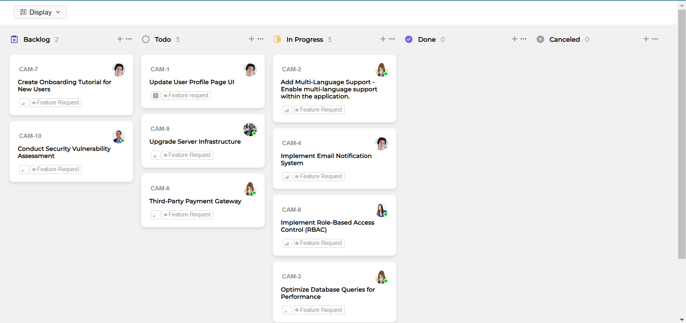

he application should offer three distinct ways to group the data:

1. **By Status**: Group tickets based on their current status.
2. **By User**: Arrange tickets according to the assigned user.
3. **By Priority**: Group tickets based on their priority level.

Users should also be able to sort the displayed tickets in two ways:

1. **Priority**: Arrange tickets in descending order of priority.
2. **Title**: Sort tickets in ascending order based on their title.

This is the output
